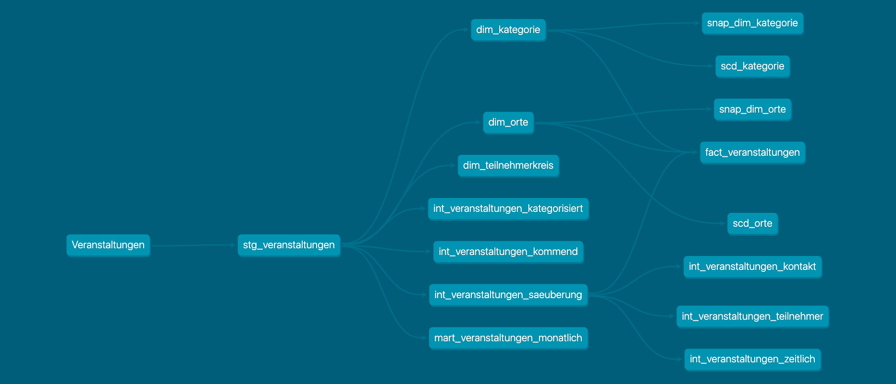
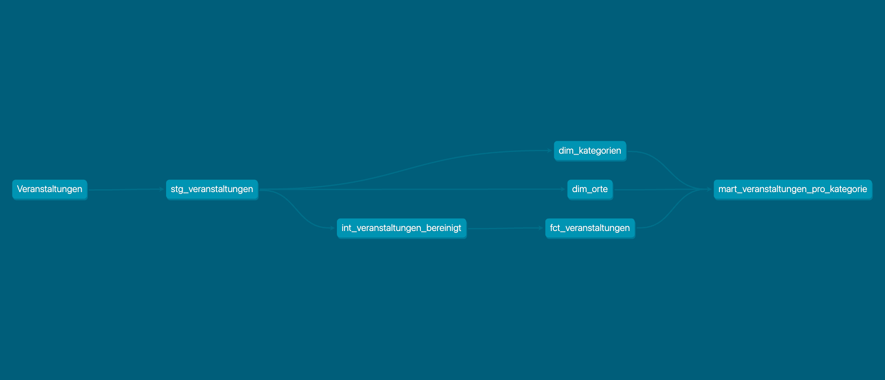
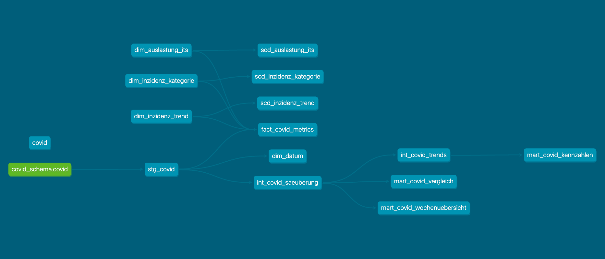
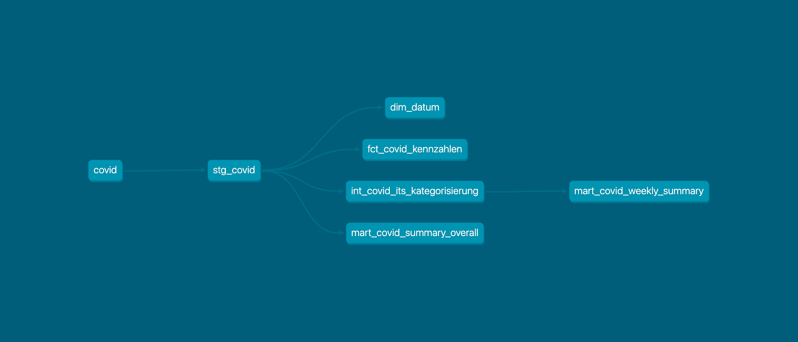

# DBT Projekte – COVID - 19 & Veranstaltungen (Manuell & GPT)

Dieses Repository enthält **vier separate DBT-Projekte** die jeweils unterschiedliche Implementierungen für Datenmodellierung und -transformation darstellen:

1. **covid_manuell** – Manuelles Covid-DBT-Projekt

2. **test_dbt** – GPT-generiertes Covid-DBT-Projekt

3. **veranstaltungen_gpt** – GPT-generiertes Veranstaltungs-DBT-Projekt

4. **veranstaltungen_manuell** – Manuelles Veranstaltungs-DBT-Projekt

### Quellen
   [Veranstaltungen](https://daten.berlin.de/datensaetze/simple_search_wwwberlindesenarbeitweiterbildungbildungszeitsuche)
   
   [Covid-19](https://daten.berlin.de/datensaetze/simple_search_wwwberlindelagesogesundheitinfektionskrankheitencoronatabellebezirkegesamtuebersicht)
   

## Ausführungsschritte
1. Abhängigkeiten installieren: `dbt deps`

2.  Seeds laden `dbt seed` lädt die Seed-Daten (z. B. CSV-Dateien) in die Datenbank.
   

3.  Snapshots ausführen (falls vorhanden) `dbt snapshot` erstellt bzw. aktualisiert Slowly Changing Dimensions (SCD).
   
4.  Modelle erstellen `dbt run` erstellt alle DBT-Modelle (Staging, Intermediate, Marts, Dimensions, Facts).
   
5.  Tests ausführen `dbt test` führt Tests aus.


### Profiles für die jeweiligen DBT-Projekte

```yaml
covid_manuell:
  outputs:
    dev:
      dbname: covid_manuell
      host: localhost
      pass: pw
      port: 5432
      schema: covid_manuell_schema
      threads: 1
      type: postgres
      user: sinan
  target: dev

test_dbt:
  outputs:
    dev:
      dbname: mein_dbt_db
      host: localhost
      password: pw
      port: 5432
      schema: test_schema
      threads: 1
      type: postgres
      user: sinan_fidan
  target: dev

veranstaltungen_gpt:
  outputs:
    dev:
      dbname: veranstaltungen_gpt
      host: localhost
      password: pw
      port: 5432
      schema: veranstaltungen_gpt_schema
      threads: 1
      type: postgres
      user: sinan_fidan
  target: dev

veranstaltungen_manuell:
  outputs:
    dev:
      dbname: veranstaltungen_manuell
      host: localhost
      password: pw
      port: 5432
      schema: veranstaltungen_manuell_schema
      threads: 1
      type: postgres
      user: sinan_fidan
  target: dev

```
### veranstaltungen_gpt


### veranstaltungen_manuell


### covid_gpt


### covid_manuell
